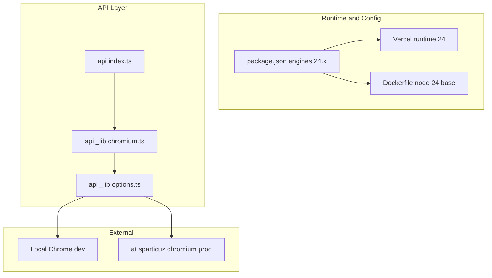

# Technical Design: node-version-upgrade-24

## Overview

本機能は、OGP 画像動的生成サービスのランタイムを Node.js 14.x から Node.js 24 系へ移行するものである。開発者および運用者が、本番・ローカル・Docker のいずれでも Node 24 で一貫してビルド・実行・検証できるようにする。

**対象ユーザー**: 開発者・運用者。既存の API（画像生成）とプレビュー Web の動作は維持し、ランタイムと本番用 Chromium 依存のみを更新する。

**影響**: 現在の `package.json`（engines）、`docker/Dockerfile`（ベースイメージ）、`api/_lib/options.ts`（本番用 Chromium 取得）、および `.kiro/steering/tech.md` の Node バージョン表記を変更する。アプリケーションの振る舞いや API 契約は変更しない。

### Goals

- Node.js 24.x を package.json の engines および Vercel・Docker で一貫して指定する。
- 本番の Headless Chrome を Node 24 互換のパッケージ（@sparticuz/chromium）に差し替え、既存の getOptions/getScreenshot 契約を維持する。
- 開発・運用ドキュメント（steering）の Node バージョン表記を 24 系に更新する。
- vercel dev / Docker / 本番デプロイで Node 24 が使用され、画像生成が完了することを確認可能にする。

### Non-Goals

- TypeScript やその他ライブラリのメジャーアップグレード（必要最小限の互換バージョン更新に留める）。
- テストフレームワークの導入や CI の変更。
- API の仕様変更や新エンドポイントの追加。

## Architecture

### Existing Architecture Analysis

- **現状**: API は `api/index.ts` が単一ハンドラ。`parseRequest` → `getHtml` → `getScreenshot` の流れはそのまま。Chromium の実行オプションは `api/_lib/options.ts` の `getOptions(isDev)` で集約され、開発時はローカル Chrome パス、本番時は chrome-aws-lambda を参照している。
- **維持する境界**: `getOptions(isDev): Promise<Options>` の戻り値の型（args, executablePath, headless）は変更しない。`chromium.ts` は getOptions の戻り値をそのまま puppeteer-core の launch に渡すため、options.ts の「本番時の中身」だけを @sparticuz/chromium に差し替える。
- **技術的負債への対応**: chrome-aws-lambda は Node 20+ 非互換のため削除し、@sparticuz/chromium に置き換える。これ以外のアーキテクチャ変更は行わない。

### Architecture Pattern & Boundary Map

本機能は**既存資産の拡張**（Extension）であり、新規コンポーネントは追加しない。設定・ランタイム・依存の更新と、既存モジュール（options.ts）の差し替えに限定する。

- **選択パターン**: 既存の「options が Chromium 取得を抽象化する」パターンを維持。本番用実装のみ chrome-aws-lambda から @sparticuz/chromium に差し替える。
- **Steering 準拠**: `api/index.ts` は薄いハンドラのまま、Chromium 詳細は `_lib` に閉じる。型は既存の `Options` をそのまま使用する。

### Technology Stack & Alignment

| Layer | Choice / Version | Role in Feature | Notes |
|-------|------------------|-----------------|-------|
| Infrastructure / Runtime | Node.js 24.x | ビルド・実行の統一ランタイム | package.json engines、Vercel は engines を参照。Docker は node:24 系ベースイメージ。 |
| Backend / Services | @sparticuz/chromium | 本番用 Chromium バイナリ取得 | options.ts から利用。executablePath(), args, headless。Puppeteer Chromium Support に合わせてバージョン選択。 |
| Backend / Services | puppeteer-core | ヘッドレスブラウザ制御（既存） | 既存のまま。@sparticuz/chromium と互換バージョンを採用。 |
| Infrastructure / Runtime | chrome-aws-lambda | 削除 | Node 24 非互換のため削除。 |

その他（marked, twemoji, TypeScript）は現状のまま。Node 24 で問題が確認された場合のみバージョン更新を検討する。

## Requirements Traceability

| Requirement | Summary | Components | Interfaces | Flows |
|-------------|---------|------------|------------|-------|
| 1.1 | package.json に Node 24.x を記載 | package.json | engines.node | — |
| 1.2 | Vercel で Node 24 をランタイムに | package.json（Vercel が engines を参照） | engines.node | — |
| 1.3 | Docker で Node 24 系ベースイメージ | docker/Dockerfile | FROM | — |
| 2.1 | API が Node 24 でパース〜画像返却 | api/index.ts, _lib/*, options.ts | getOptions, getScreenshot | parseRequest → getHtml → getScreenshot |
| 2.2 | プレビュー Web が Node 24 で動作 | web/ | — | 既存ビルド・配信のまま |
| 2.3 | 非互換依存の更新・差し替え | options.ts, package.json | — | 本番時 Chromium を @sparticuz/chromium に差し替え |
| 3.1 | 全 npm パッケージが Node 24 で利用可能 | package.json | dependencies, devDependencies | — |
| 3.2 | 非互換パッケージの更新・代替 | package.json, options.ts | — | chrome-aws-lambda 削除、@sparticuz/chromium 追加 |
| 3.3 | npm install が Node 24 で成功 | package.json | — | — |
| 4.1 | tech.md 等の Node 表記を 24 系に | .kiro/steering/tech.md | — | — |
| 4.2 | 必要ツール記載を Node 24.x に | .kiro/steering/tech.md | — | — |
| 4.3 | Docker 手順で Node 24 イメージを明記 | .kiro/steering/tech.md | — | — |
| 5.1 | vercel dev で Node 24 起動・画像生成 | 全体 | — | 手動検証 |
| 5.2 | Docker で Node 24 ビルド・画像生成 | docker/ | — | 手動検証 |
| 5.3 | 本番 Vercel で Node 24 確認可能 | Vercel 設定 / ログ | — | デプロイ後確認 |

## Components and Interfaces

| Component | Domain/Layer | Intent | Req Coverage | Key Dependencies | Contracts |
|-----------|--------------|--------|--------------|-------------------|-----------|
| package.json | Config | Node 24.x のランタイム指定と依存の更新 | 1.1, 1.2, 3.1, 3.2, 3.3 | — | — |
| docker/Dockerfile | Infrastructure | Node 24 系ベースイメージでビルド・実行環境を提供 | 1.3, 5.2 | — | — |
| api/_lib/options.ts | Backend | 開発/本番で Chromium 起動オプションを返す。本番時は @sparticuz/chromium を利用 | 2.1, 2.3, 3.2 | @sparticuz/chromium (P0), puppeteer-core (P0) | Service |
| .kiro/steering/tech.md | Documentation | ランタイム・必須ツール・Docker の Node 24 表記 | 4.1, 4.2, 4.3 | — | — |

api/_lib/chromium.ts は変更しない。getOptions(isDev) の戻り値契約が維持されるため、既存の呼び出しのまま利用する。

### Backend / Services

#### api/_lib/options.ts

| Field | Detail |
|-------|--------|
| Intent | 開発時はローカル Chrome の実行パスとオプションを、本番時は @sparticuz/chromium の executablePath/args/headless を返す。 |
| Requirements | 2.1, 2.3, 3.2 |

**Responsibilities & Constraints**

- 単一責務: Chromium 起動に必要なオプション（args, executablePath, headless）の取得のみを担当する。
- 既存の `Options` 型（args: string[], executablePath: string, headless: boolean）を維持する。呼び出し元（chromium.ts）は変更しない。
- 本番時は @sparticuz/chromium の `executablePath()`（非同期）、`args`、`headless` を使用する。chrome-aws-lambda の import を削除する。

**Dependencies**

- Inbound: なし（環境変数や process は既存どおり）。
- Outbound: chromium.ts — getOptions の戻り値を launch に渡す (P0)。
- External: @sparticuz/chromium — 本番用 Chromium バイナリパスと起動引数 (P0)。

**Contracts**: Service [x]

##### Service Interface

- **getOptions(isDev: boolean): Promise<Options>**
  - Preconditions: なし。
  - Postconditions: 戻り値は puppeteer-core の `launch()` に渡せる形状（args, executablePath, headless）である。
  - Invariants: isDev が true のときはローカル Chrome パス、false のときは @sparticuz/chromium 由来の値を返す。

**Implementation Notes**

- Integration: options.ts 内で `import chromium from '@sparticuz/chromium'` に変更。本番分岐で `executablePath: await chromium.executablePath()`、`args: chromium.args`、`headless: chromium.headless`（またはドキュメントどおりの値）を設定する。
- Validation: 実装後に `vercel dev`（開発）とデプロイ後（本番）の両方で画像生成が成功することを確認する。
- Risks: @sparticuz/chromium のバージョンと puppeteer-core の組み合わせが非互換の場合、Puppeteer Chromium Support に従いバージョンを調整する。

### Config / Infrastructure（要約のみ）

- **package.json**: `engines.node` を `"24.x"` に変更。`dependencies` から `chrome-aws-lambda` を削除し、`@sparticuz/chromium` を追加（バージョンは Puppeteer Chromium Support に準拠）。puppeteer-core は互換バージョンに更新する。
- **docker/Dockerfile**: `FROM` を node:24 系（例: node:24-bookworm-slim）に変更。既存の RUN や USER は必要に応じて Bookworm 環境で動作するよう修正する。
- **.kiro/steering/tech.md**: 「Node.js 14.x」を「Node.js 24.x」に置換（Runtime と Required Tools の 2 箇所）。Docker 利用時は Node 24 系イメージを用いる旨を追記する。

## Data Models

本機能では新規のデータモデルや永続化は導入しない。既存の `ParsedRequest` や `Options` 型をそのまま使用する。Options の型定義は変更せず、options.ts が返す値の「取得元」のみが chrome-aws-lambda から @sparticuz/chromium に変わる。

## Error Handling

既存のエラー戦略を維持する。Chromium 起動失敗時は既存と同様に 500 と HTML メッセージを返す。@sparticuz/chromium の executablePath() 失敗やタイムアウトは、既存の getScreenshot 周りのエラーハンドリングで捕捉する。設計上、新たなエラー種別の追加は行わない。

## Testing Strategy

- **手動検証（既存方針のまま）**: vercel dev でローカル起動し、プレビューと画像生成が成功することを確認する。Docker でビルド・実行し、同様に画像生成が完了することを確認する。デプロイ後、本番 URL で画像生成リクエストを送り、Node 24 が使用されていること（Vercel のログまたは設定で確認）とレスポンスが正常であることを確認する。
- **単体テスト**: 本機能ではテストフレームワークを導入しない。必要に応じて options.ts の本番分岐で executablePath/args が取得できることを手動で確認する。

## Migration Strategy

- **Phase 1（設定・ドキュメント）**: package.json の engines を 24.x に変更。Dockerfile の FROM を node:24 系に変更。tech.md の Node 表記を 24 系に更新。この時点では chrome-aws-lambda を残したままにすると Node 24 でインストールや実行が失敗する可能性が高いため、Phase 2 と連続して実施することを推奨する。
- **Phase 2（Chromium 差し替え）**: package.json から chrome-aws-lambda を削除し、@sparticuz/chromium と互換バージョンの puppeteer-core を追加。options.ts の import と本番分岐の実装を @sparticuz/chromium に差し替える。chromium.ts は変更しない。
- **検証**: 各 Phase 後、可能な範囲で vercel dev および Docker でビルド・起動・画像生成を確認する。Phase 2 完了後に本番デプロイし、Node 24 と画像生成の動作を確認する。
- **ロールバック**: 問題発生時は package.json の engines と依存を 14.x / chrome-aws-lambda に戻し、Dockerfile と tech.md を元に戻して再デプロイする。

## Supporting References

- 技術調査とバージョン選定の詳細は `.kiro/specs/node-version-upgrade-24/research.md` を参照。
- Vercel の Node 24 設定: [Vercel Docs — Configuring the Runtime](https://vercel.com/docs/functions/configuring-functions/runtime)。
- @sparticuz/chromium の利用方法: [npm @sparticuz/chromium](https://www.npmjs.com/package/@sparticuz/chromium)。
